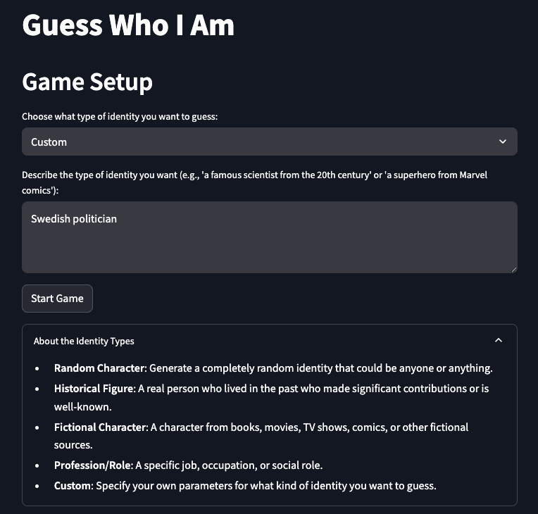
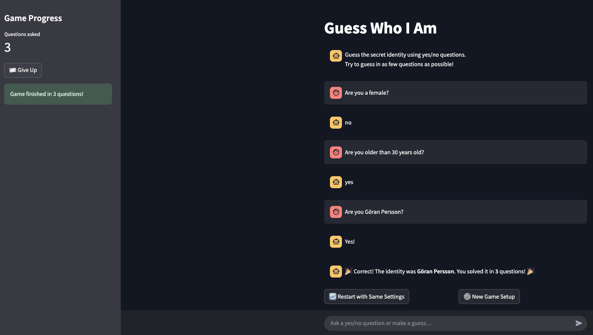

# 🕹️ Guess Who I Am – AI game

A fun, local AI-powered game where you guess a hidden identity through yes/no questions. Built with Streamlit and powered by a local LLM via Ollama.

---

## 🧠 What Is This?

This app lets you interact with an AI that pretends to be a mystery identity — such as a historical figure, fictional character, or profession. Your goal is to guess the identity by asking strategic yes/no questions.

Inspired by classic guessing games, this version runs locally and uses structured JSON replies via LLM and Pydantic validation.

---
<p align="center">
  
</p>

---

<p align="center">
  
</p>

---

## ✨ Features

- 🔎 Identity types: Random, Historical, Fictional, Role, or Custom
- 🧠 Powered by [Ollama](https://ollama.com) and your local LLM
- 📦 Robust validation using Pydantic
- ⚡ Built with [Streamlit](https://streamlit.io) for rapid UI
- ♻️ Dynamic game loop with restart and setup options

---

## ⚙️ Setup Instructions

### 1. Clone the repo

```bash
git clone https://github.com/Leonnorblad/guessing_game
cd guessing_game
```

### 2. Create a virtual environment (optional but recommended)

```bash
python -m venv venv
source venv/bin/activate      # On Windows: venv\Scripts\activate
```

### 3. Install the required packages

```bash
pip install -r requirements.txt
```

### 4. Set up Ollama

Ensure [Ollama](https://ollama.com) is installed and running.

Then pull a local model, such as:

```bash
ollama pull llama3:8b
```

> 🔁 You can change the model in `MODEL_NAME` at the top of `app.py`:
> ```python
> MODEL_NAME = "llama3.1:8b"
> ```

---

## 🚀 Launch the App

```bash
streamlit run app.py
```

The app will open in your browser. Follow the setup to start guessing!

---

## 🧩 Game Flow

1. **Choose an identity type** (or enter custom details).
2. **Ask yes/no questions** to reveal clues.
3. **Guess the identity** when you feel confident.
4. **Restart or try a new identity** when done.

---
